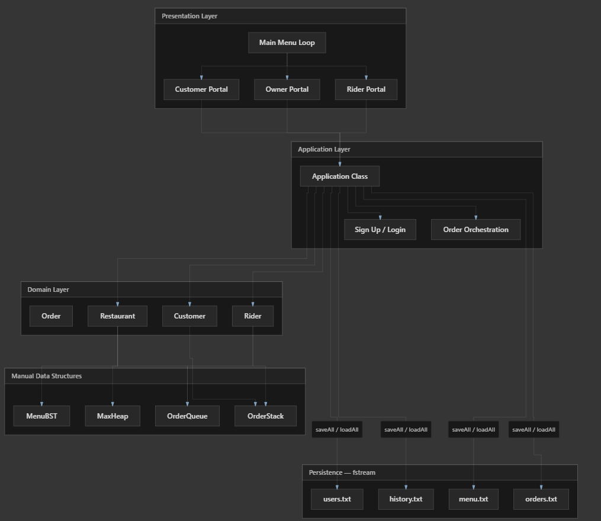
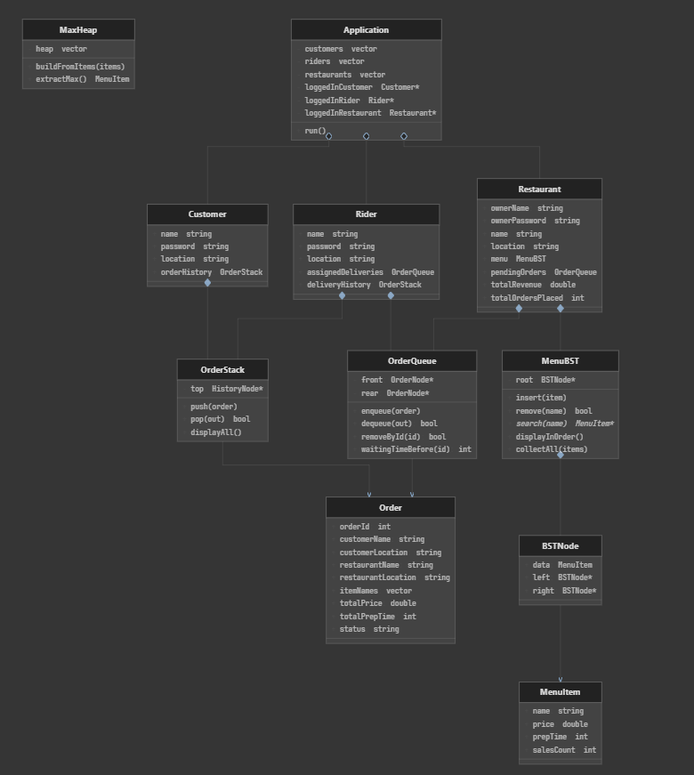
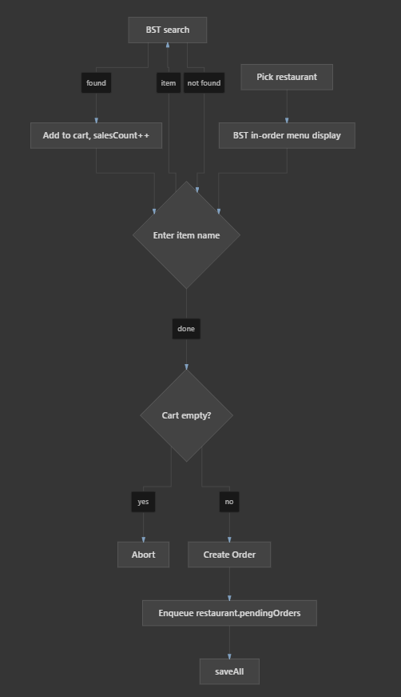
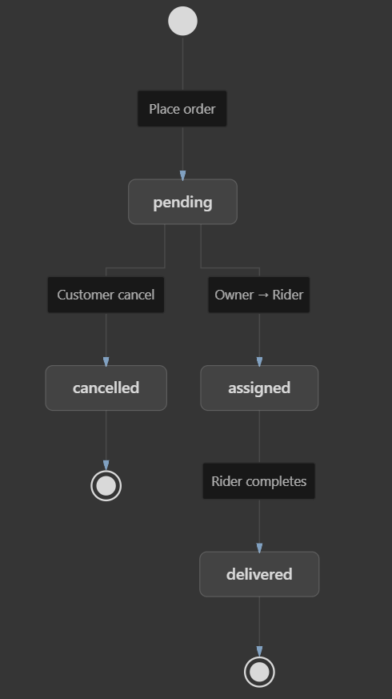
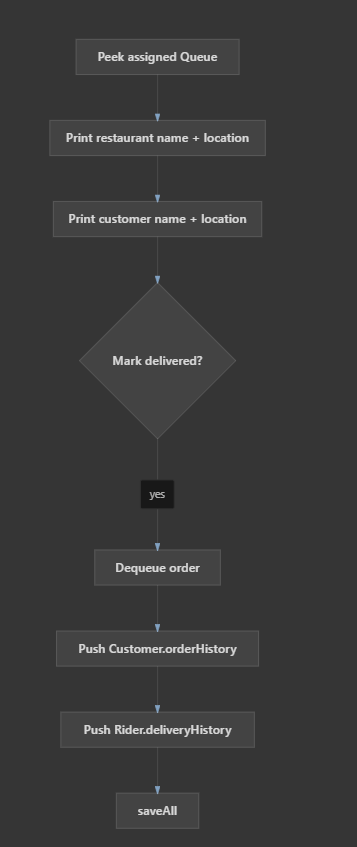
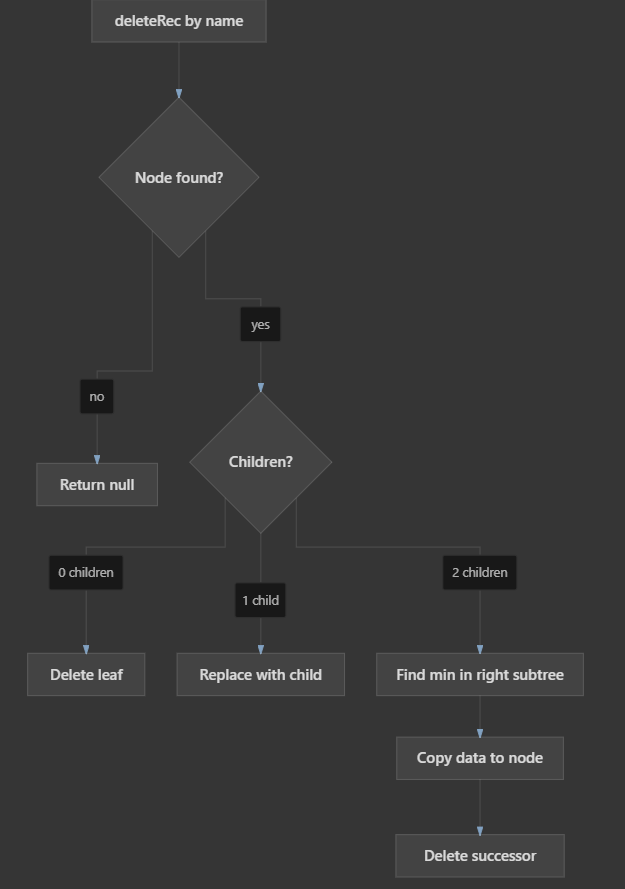

# Terminal-Based Food Delivery Application

A terminal-based food delivery platform built in C++, simulating a full delivery ecosystem across three user roles — Customers, Restaurant Owners, and Riders — with menu browsing, order placement, live queue tracking, delivery history, and sales analytics.

Built as a lab project for a Data Structures and Algorithms course, with a deliberate focus on implementing every core data structure by hand — strictly avoiding STL containers (aside from `std::vector` for dynamic arrays) — to demonstrate real understanding of memory management, pointer manipulation, and underlying algorithmic mechanics.

---

## What it does

- **Role-based access** for Customers, Restaurant Owners, and Riders, each with their own portal
- **Menu browsing and search** — restaurant menus are kept in alphabetical order and searchable platform-wide
- **Order placement** — customers select multiple items, with total cost and estimated prep time calculated automatically
- **FIFO order processing** — pending orders are handled strictly in the order they were placed
- **Live wait-time tracking** — customers can see their estimated wait based on every order ahead of them in the queue
- **Delivery assignment** — orders are routed to the rider with the fewest current tasks
- **Order and delivery history** — customers and riders can review their most recent activity first
- **Automated sales analytics** — restaurant owners get an instant "Most Sold Items" report
- **Persistent storage** — all users, menus, orders, and history are saved to disk and reloaded automatically on startup

---

## Data Structures & Algorithms

This project's core purpose was to genuinely implement these structures from scratch, not just use built-in equivalents:

| Structure | Purpose | Why this structure |
|---|---|---|
| **`MenuBST`** — Binary Search Tree | Stores and manages each restaurant's menu items | Keeps items in sorted (alphabetical) order; average `O(log n)` insert, search, and delete |
| **`OrderQueue`** — custom linked-list queue | Manages pending restaurant orders and active rider deliveries | Enforces strict FIFO processing so the earliest order is always handled first; `O(1)` enqueue/dequeue |
| **`OrderStack`** — custom linked-list stack | Tracks order history for customers and delivery history for riders | LIFO behavior surfaces the most recent activity first; `O(1)` push/pop |
| **`MaxHeap`** — vector-backed binary heap | Generates sales analytics for restaurant owners | Efficiently and repeatedly extracts the highest-selling item; `O(n)` to build, `O(log n)` per extraction |

---

## Built with

| Layer | Technology |
|---|---|
| Language | C++ |
| Custom data structures | Binary Search Tree, Queue, Stack, Max Heap — all hand-built with raw pointers |
| Data storage | Delimiter-separated plain text files (`users.txt`, `menu.txt`, `orders.txt`, `history.txt`) |
| Core libraries | `<iostream>`, `<fstream>`, `<vector>`, `<string>` |

---

## Project Structure

```
food_delivery.cpp
│
├── [Globals]
│   └── nextOrderId
│
├── MANUAL DATA STRUCTURES
│   ├── MenuItem          — menu value object
│   ├── MenuBST / BSTNode — sorted menu (by item name)
│   ├── Order             — shared order record
│   ├── OrderQueue        — FIFO (linked list)
│   ├── OrderStack        — LIFO (linked list)
│   └── MaxHeap           — sales ranking for analytics
│
├── UTILITIES
│   └── trim, split, joinItems, parseItems
│
├── DOMAIN CLASSES
│   ├── Customer
│   ├── Rider
│   └── Restaurant
│
├── APPLICATION
│   ├── Lookup helpers (findCustomer, findRider, findRestaurant)
│   ├── FILE HANDLING
│   │   ├── saveUsers / loadUsers
│   │   ├── saveMenus / loadMenus
│   │   ├── saveOrders / loadOrders
│   │   └── saveHistory / loadHistory
│   ├── Customer menus (7 actions)
│   ├── Owner menus (7 actions)
│   └── Rider menus (4 actions)
│
└── MAIN APPLICATION LOOP
    └── main() → Application::run()
```

---

## Core Components

| Component | Responsibility |
|---|---|
| `MenuBST` | Stores restaurant menu items as `BSTNode`s; recursive insert, search, delete, and in-order traversal for a clean sorted display |
| `OrderQueue` | Linked list of `OrderNode`s with front/rear tracking; enqueue, dequeue, and wait-time calculation |
| `OrderStack` | Linked list of `HistoryNode`s pushed/popped from the top; deep-copy safe to avoid shallow-copy memory leaks |
| `MaxHeap` | 0-indexed vector representing a complete binary tree; `heapifyUp`/`heapifyDown` and `extractMax()` |
| Customer / Restaurant Owner / Rider portals | Role-specific menus routing to browsing, ordering, processing, and analytics functionality |

---

## Core Algorithms

**Menu search/insert/delete:** recursive BST traversal — `findMin()` handles deletion of nodes with zero, one, or two children; `inorderRec()` renders the menu in sorted order

**Order processing:** dequeue the earliest pending order → assign it to the rider with the fewest active tasks

**Wait-time calculation:** traverse the queue, summing `totalPrepTime` for every order ahead of a given customer — `O(n)`

**Sales analytics:** build the heap from `salesCount` values (`O(n)`) → repeatedly `extractMax()` to produce the "Most Sold Items" report (`O(log n)` per extraction)

---

## Getting it running

```bash
g++ -o food_delivery food_delivery.cpp -std=c++11
./food_delivery
```

On first run, the system creates/reads `users.txt`, `menu.txt`, `orders.txt`, and `history.txt` in the working directory — make sure the program has write access there. All manual data structures (BSTs, linked lists) are rebuilt from these files at startup and safely destroyed on exit to prevent memory leaks.

---

## Diagrams

**Architecture**



**Class Diagram**



**Order Placement Flow**



**Order Status Flow**



**Delivery Flow**



**BST Deletion Flow**



---

## Known Limitations

- Console-only interface, no GUI
- No encryption for stored data
- Single-user environment — no concurrent access handling
- Custom delimiter-based text parsing instead of a real database engine

---

## Possible Future Work

- A graphical interface
- Real database integration in place of text files
- Multi-threaded order processing for true concurrency
- Real-time GPS-based rider tracking
- Payment gateway integration

---

## License

Built for academic purposes as part of a Data Structures and Algorithms course.
